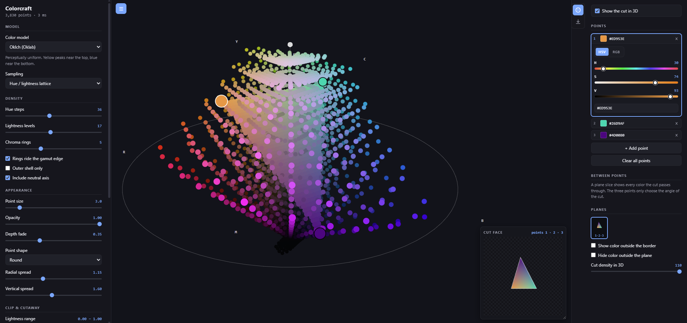

# Colorcraft

An interactive 3D view of color space, and a palette tool built on top of it.
No build step, no dependencies, no server — open `index.html` and it runs.

**[Try it →](https://square-atom.github.io/Colorcraft/)**




Hue runs around the circle, chroma outward from a neutral core, lightness bottom
to top — black at the floor, white at the ceiling.

The point of it is the **shape**. In a perceptual model each hue reaches its most
saturated form at a *different* height: yellow peaks near the top, blue near the
bottom, red somewhere in between. So the solid comes out a lopsided blob rather
than a tidy cylinder. That lopsidedness is what color actually looks like, and
it is exactly what HSV flattens away.

## Running it

Clone it and open `index.html`. That's the whole procedure — the scripts are
plain classic scripts specifically so `file://` works.

If you'd rather serve it, `serve.py` is a small no-cache static server:

```bash
python serve.py 5580
```

## Color models

| Model | Shape |
| --- | --- |
| **Oklch** (default) | Perceptually uniform, modern. Yellow high, blue low. |
| **CIE LCh** | The 1976 L\*a\*b\* equivalent. Same idea, older math. |
| **HSV** | A flat cylinder — every hue forced to the same level. |
| **HSL** | A bicone. Tapers correctly to black and white, still ignores real brightness. |

Switch between Oklch and HSV to see what the perceptual model buys you: HSV puts
pure yellow and pure blue at exactly the same height, which is why it looks so
even and reads so poorly as a picture of brightness.

## Sampling

Three ways to populate the same space.

**Hue / lightness lattice** walks the model's own coordinates and asks what color
sits at each position. Even rings and spokes; a diagram of the model.

**sRGB cube** walks the display's colors instead and asks where each one lands.
Every point is displayable by construction, and the clumping is real information
— it shows how unevenly RGB is spread through perceptual space.

**sRGB inside a wider gamut** draws sRGB in full color wrapped in a greyed shell
marking a larger space: Display P3, Adobe RGB (1998), Rec. 2020, or the raw LCh
coordinate cylinder.

The envelope is deliberately neutral rather than colored. Those are by definition
colors sRGB cannot show, so painting them in sRGB would be a lie; grey says
"there is color out here your screen cannot reach", which is the honest claim.

## Seeing inside a dense solid

The cloud gets thick fast, so several controls exist purely to open it up:

- **Outer shell only** — draw just the gamut boundary, leaving the interior hollow
- **Cutaway wedge / position** — slice a wedge out and look into the core
- **Lightness range**, **Chroma range** — clip to a horizontal slab or a ring
- **Opacity** — see through the outer layers
- **Depth fade** — fade distant points toward the background for depth
- **Radial spread**, **Vertical spread** — stretch the geometry so points separate

**Rings ride the gamut edge** decides how chroma is sampled. When on, the outer
ring sits exactly on the most saturated color available at that lightness, so the
silhouette traces the true gamut. When off, rings are spaced at uniform absolute
chroma and stop where they run out of gamut — a ragged edge, but an honest sense
of how much chroma each hue really has.

## Palette

The solid sits in the middle with a panel either side: **Display** on the left for
how the solid is drawn, **Palette** on the right for building things from it.

### Points

Add a point first, then color it. The selected point's editor unfolds inside its
row and everything else stays collapsed; click any point to bring its own sliders
back exactly where you left them.

The editor has an HSV/RGB toggle, three sliders whose tracks preview what moving
that one slider would do, and a text field:

```
#ff8800   f80   255 136 0   rgb(255,136,0)   hsv 30 100 100   hsl(30,100,50)
```

Bare triples are read as 0–255 unless they look normalised (`0.5 0.2 0.9`).

In the 3D view every point is a circle, and the border says which is selected:
**white for the selected point, black for the rest**. Points always draw over the
solid, so a color deep in the interior is still visible.

### Ramps

Two points draw a gradient between them; three or more cut a plane. The point
count decides, so there is nothing to pick.

**Blend in** is the control worth playing with. A gradient has no single correct
path — it depends entirely on which space you average in, and the difference is
large. Blue `#0033ff` to yellow `#ffdd00`, same endpoints every time:

| Blend space | Midpoint | |
| --- | --- | --- |
| Oklab — straight line | `#7ca1be` | a chord straight through the solid |
| Oklch — polar arc | `#00c6a4` | bows outward through teal, keeping chroma up |
| CIELAB — straight line | `#c684a3` | |
| CIE LCh — polar arc | `#ff0066` | arcs the *other* way, through magenta |
| Linear RGB | `#bca5bc` | physically correct light mixing |
| sRGB — naive | `#808880` | the muddy grey midpoint everyone complains about |

Watching six paths take visibly different routes between the same two points is
the clearest explanation of why gradient code cares about color space.

Polar arcs keep chroma high through the middle, which is usually what you want
from a ramp — but it also pushes the path outside sRGB. Those colors are clamped
back in and marked with a dashed ring, so you can see where the ramp left the
gamut. Generated ramps appear as a swatch strip; click a swatch to copy its hex,
or **Copy all** for the whole list.

### Plane slices

Three points define a plane, and that plane cuts the solid open. The **cut face**
shows *every* color the cut passes through — not just a blend of the three you
picked. Those three only choose the angle.

By default the face is bounded by the triangle its points make; **Show color
outside the border** lets it run out to the gamut edge instead. **Show the cut in
3D** puts the same face back inside the solid it came from, and **Hide color
outside the plane** drops the solid entirely, leaving the cut alone in space.

With four or more points, every combination of three becomes its own plane — five
points give ten distinct cross-sections, picked from a thumbnail grid.

The **Export** tab saves them all to one PNG sheet, four to a row, each labelled
with the points that cut it. Set the file name and a scale from ¼× to 4×; a face
is 320px at 1×, so four planes come out at 1360 × 374, or 5440 × 1496 at full
size. The exact dimensions are shown before you save.

## Controls

| Input | Action |
| --- | --- |
| Drag | Rotate |
| Shift-drag / right-drag | Pan |
| Wheel | Zoom |
| Hover | Read off hex and coordinates |
| Click | Copy hex |
| `R` / double-click | Reset view |
| `Space` | Auto-rotate |
| `[` / `]` | Hide the left / right panel |
| `H` | Hide both panels |

Clicking the palette's current tab hides it too.

## Embedding

Which panels start open can be set from the URL, which is what makes the page
usable in a frame far narrower than a window:

| URL | Result |
| --- | --- |
| `index.html` | Both panels open |
| `index.html?panels=left` | Display panel only |
| `index.html?panels=right` | Palette only |
| `index.html?panels=none` | Just the solid — a clean showcase |

Either panel is still one click away from its button, so nothing is lost.

### Publishing with GitHub Pages

The repo is already a static site with `index.html` at the root, so no build or
config is needed:

1. Push to GitHub
2. **Settings → Pages → Source: Deploy from a branch**
3. Pick your branch and **/ (root)**, then save

It lands at `https://square-atom.github.io/Colorcraft/` within a minute or two.

### Embedding in Wix

With the site live on Pages, in the Wix editor choose **Add → Embed Code →
Embed a Site** and point it at, for example:

```
https://square-atom.github.io/Colorcraft/?panels=none
```

Make the element as wide and tall as the section allows — the two panels are
636px combined, so a narrow embed is worth pairing with `?panels=left` or
`?panels=none`.

Because the panels can be reopened from their buttons, `?panels=none` is usually
the best default for a page embed: visitors get the solid, and the controls are
there if they want them.

Worth adding an **Open full screen** link next to the embed, pointing at the same
URL without parameters. Casual visitors get something to play with in-page, and
anyone interested gets the real thing with room to work.

Nothing here phones home — it is all client-side canvas, with no external
requests, so there is no CSP or privacy wrinkle to work around.

## How it works

Rendering is Canvas 2D rather than WebGL. Back-to-front alpha blending is what
makes the interior readable, and that needs a depth sort either way; the sort is
a counting sort into depth buckets, so it stays linear as density climbs. Points
carry prebuilt color strings so the common full-opacity path does no per-frame
string formatting.

The gamut boundary is found by bisection on chroma. Any RGB gamut is star-shaped
about the neutral axis in both Oklab and CIELAB, so in-gamut is a single
contiguous interval and a plain binary search is safe.

Gamuts are defined by their published CIE xy chromaticities, with the XYZ
matrices derived from those at load time rather than transcribed. Deriving beats
copying: the matrices are long strings of digits that are easy to get subtly
wrong, and adding a gamut becomes eight numbers you can check against a spec. The
derived sRGB matrix agrees with the published one to six decimal places.

Only primaries matter for that — a gamut's volume is fixed by its primaries and
white point, and the transfer curve only affects encoding within it. Every gamut
test happens in linear light, so no transfer function is involved.

Plane geometry lives in unscaled model space, so the spread sliders cannot change
which colors a cut passes through. Scaling is linear, so a cut stays planar once
the renderer applies it.

## Layout

```
index.html
css/style.css
js/color.js       sRGB, Oklab, CIELAB, XYZ, HSV, HSL conversions
js/gamuts.js      RGB working spaces, matrices derived from chromaticities
js/models.js      the four solids behind one generic interface
js/cloud.js       point cloud construction
js/ramp.js        color parsing, blend spaces, gradients
js/slice.js       plane geometry and cross-section rasters
js/renderer.js    orbit camera, painter's algorithm, picking
js/app.js         controls, input, frame loop
serve.py          optional no-cache dev server
```

`js/color.js` is deliberately written as pure, allocation-free functions with no
dependencies, so it ports to C, GLSL, or anything else more or less mechanically.

`js/models.js` is where the geometry lives. Every model exposes the same three
operations — `toRGB`, `fromRGB`, `maxC` — so the cloud builder and renderer never
branch on which model is active. Adding a fifth model means adding one object.

## Credits

The color science here is published work, not mine. This project is an interface
onto it, and the interesting parts belong to:

- **Oklab** — devised and published by [Björn Ottosson](https://bottosson.github.io/posts/oklab/)
- **CIELAB** and the **CIE xy** chromaticity system — CIE standards
- **The RGB ↔ XYZ matrix derivation** — the method documented by
  [Bruce Lindbloom](http://www.brucelindbloom.com/)
- **Gamut primaries** — from the sRGB (IEC 61966-2-1), Display P3, Adobe RGB
  (1998) and Rec. 2020 (ITU-R BT.2020) specifications

## License

[MIT](LICENSE) — use it, change it, sell it, no attribution required. If any of
it is useful to you, take it.
